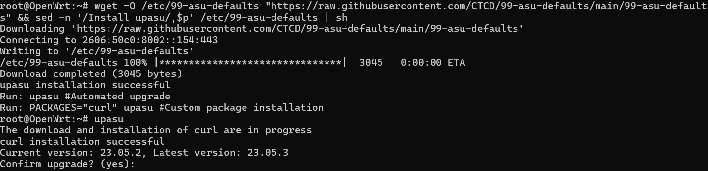

# 99-asu-defaults
## This script is for upgrading OpenWrt firmware and supports preserving user configuration and installed packages after resetting the device.

### You can download the script and Install upasu using the following command in your SSH session:
`wget -O /etc/99-asu-defaults "https://raw.githubusercontent.com/CTCD/99-asu-defaults/main/99-asu-defaults" && sed -n '/Install upasu/,$p' /etc/99-asu-defaults | sh`

### Usage:
* To perform an automated firmware upgrade:
* `upasu`
* To install specific packages along with the upgrade (replace packagename with the actual package name):
* `PACKAGES="packagename" upasu`
* Add the cron job to run the upasu script monthly. For example, to run the script on the 1st day of every month at 1:00 AM:
* `echo "0 1 1 * * echo yes | upasu" >>/etc/crontabs/root`

